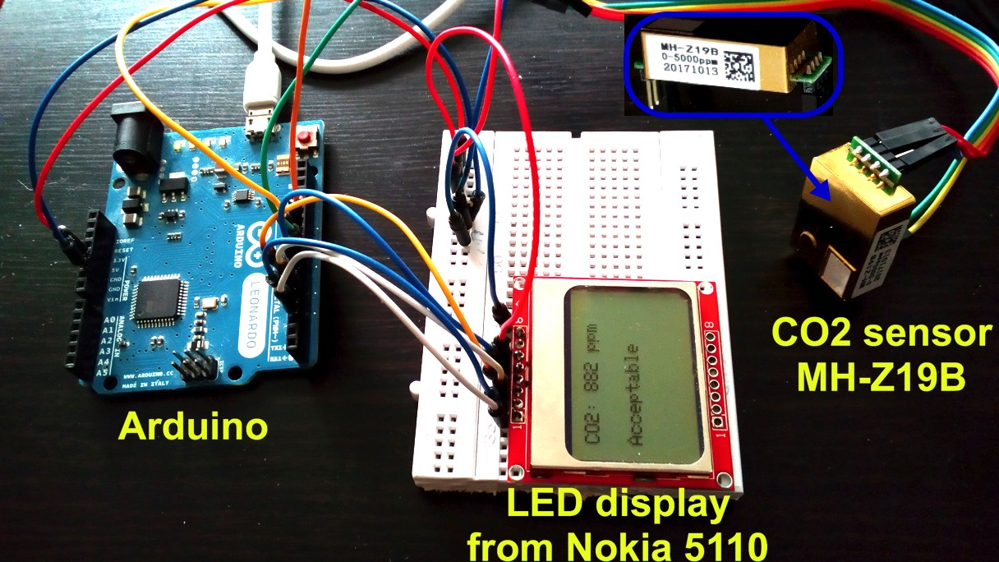

# The Arduino with CO2 sensor MH-Z19B (v2) and LCD display from Nokia 5110.
There are two ways to read data from the sensor:
* from PWM output 
* from serial port

There is a sketches for each of these ways. The one, which uses serail port - works more stable.

